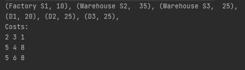
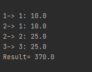

# Laboratorul 2 PA Asan Laurentiu 2A2

## Tasks
### Compulsory (1p)
```  
 - [✓] Create an object-oriented model of the problem. You should have (at least) the following classes: Source, Destination, Problem.
The sources and the destinations have names. The sources will also have the property type. The available types will be implemented as an enum . For example:
public enum SourceType {
    WAREHOUSE, FACTORY;
}
Assume S1 is a factory and S2, S3 are warehouses.
 - [✓] Each class should have appropriate constructors, getters and setters.
Use the IDE features for code generation, such as generating getters and setters.
 - [✓] The toString method form the Object class must be properly overridden for all the classes.
Use the IDE features for code generation, for example (in NetBeans) press Alt+Ins or invoke the context menu, select "Insert Code" and then "toString()" (or simply start typing "toString" and then press Ctrl+Space).
 - [✓] Create and print on the screen the instance of the problem described in the example.

```

### Optional (2p)
```
 - [✓] Override the equals method form the Object class for the Source, Destination classes. The problem should not allow adding the same source or destination twice.
 - [✓] Instead of using an enum, create dedicated classes for warehouses and factories. Source will become abstract.
 - [✓] Create a class to describe the solution.
 - [✓] Implement a simple algorithm for creating a feasible solution to the problem (one that satisfies the supply and demand constraints).
 - [✓] Write doc comments in your source code and generate the class documentation using javadoc.
```


## Explanations:

Am structurat rezolvarea in 2 pachete: compulsory si optional. Ambele contin doc comments.

Pe partea de compulsory, am creat clasele necesare fiecare avand constructori, metode get, metode set si acolo unde a fost nevoie am facut si override la metoda "toString".
Folosind toate acestea am creat o instanta a problemei si am afisat-o.




Pe partea de optional, am luat aceleasi clase create anterior si le-am restructurat. 
Am facut override la metoda "equals" pentru a nu accepta obiecte de tipul Source sau Destination dublicate. 
Am schimbat clasa Source intr-una abstracta si am creat 2 subclase Factory si Warehouse. 
Am creat clasa Solution care rezolva problema noastra utilizand un algoritm din clasa "Algorithm" si ne afiseaza solutia si rezultatul.
Algoritmul ales se numeste "North West Corner Method", acesta incepe din coltul stanga-sus al matricei de cost si in functie de valorile supply-ului si a demand-ului, acesta avanseaza pe linia sau coloana urmatoare, pana cand reuseste sa completeze toate constrangerile de cerere si oferta.
Algoritmul nu va lua in considerare o linie sau o coloana a carui constrangeri au fost indeplinite datorita unei matrici ajutatoare care completeaza cu true/false coloane sau randuri intregi daca anumite constrangeri au fost indeplinite.


